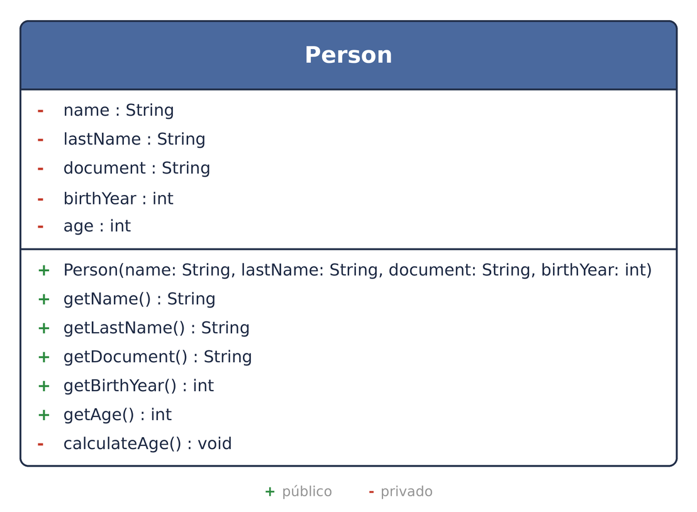
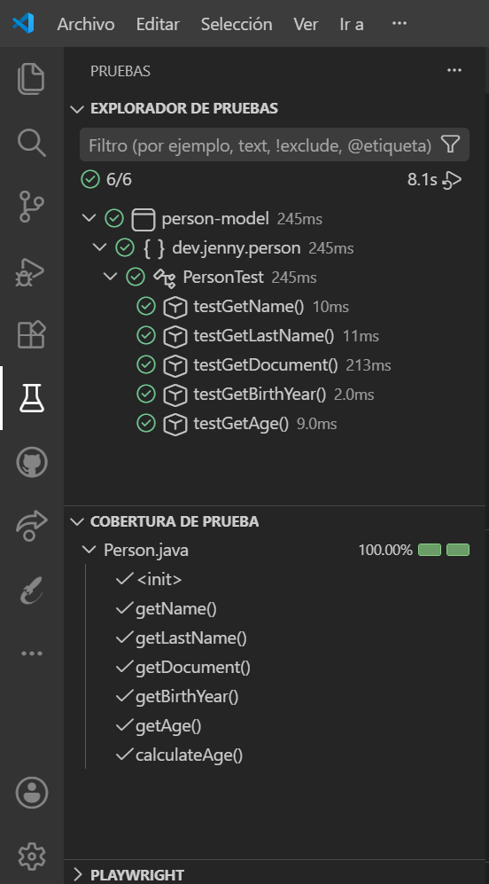
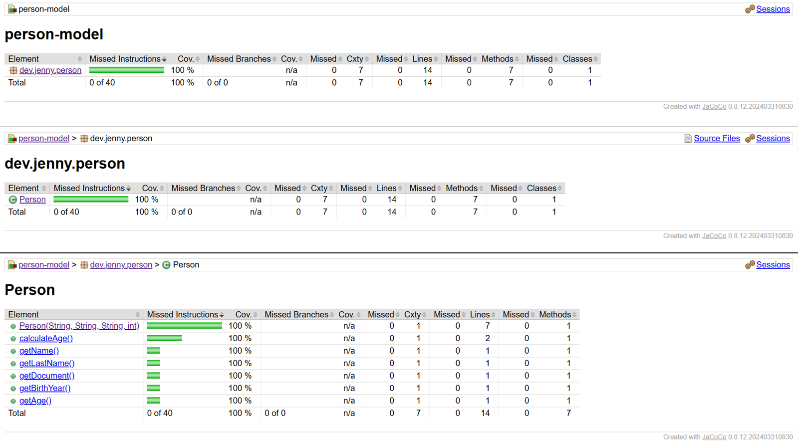
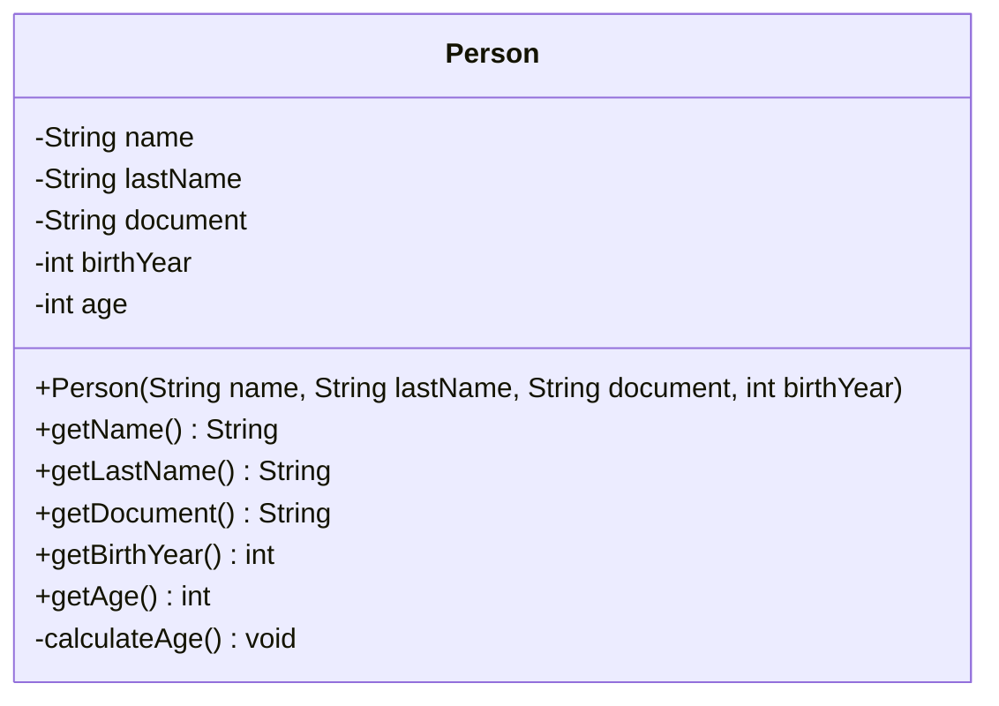

# 👩‍💼 Mi primer modelo con Java

> Modelado de la entidad **Person** en **Java 21 con Maven**, desarrollado siguiendo la metodología **TDD (Test-Driven Development)** con **JUnit 5** y **Hamcrest**, y con cobertura de tests medida con **JaCoCo**.

---

## 📸 Vista previa

|                          Diagrama de clase                          |                            Tests                             |                              Cobertura                               |
| :-----------------------------------------------------------------: | :----------------------------------------------------------: | :------------------------------------------------------------------: |
|  |  |  |

---

## 📑 Índice

- [Descripción](#-descripción)
- [Enunciado](#-enunciado)
- [Diagrama de clase](#-diagrama-de-clase)
- [Testing](#-testing)
- [Cobertura de tests](#-cobertura-de-tests-coverage)
- [Cómo reproducir el proyecto](#-cómo-reproducir-el-proyecto)
- [Estructura del repositorio](#-estructura-del-repositorio)
- [Tecnologías](#-tecnologías)
- [Recursos](#-recursos)
- [Autora](#-autora)

---

## 📋 Descripción

El objetivo de este proyecto es modelar el concepto de una **persona** como una entidad de dominio en Java, aplicando **TDD (Test-Driven Development)**. Cada funcionalidad sigue el ciclo completo, que puede seguirse paso a paso en el historial de _commits_. El ciclo consiste en:

- 🔴 **Red** — escribir primero un test que falla.
- 🟢 **Green** — escribir el código mínimo para que ese test pase.
- 🔵 **Refactor** — limpiar y mejorar el código, si es necesario, asegurándose de que los tests sigan pasando.

Los requisitos principales son:

1. **Modelar la clase `Person`** con sus atributos (nombre, apellido, número de documento, año de nacimiento y edad).
2. **Calcular la edad** mediante un método, en función del año de nacimiento.
3. **Testear la clase** de forma completa, cubriendo todos los escenarios.
4. **Insertar el diagrama de clase** de `Person` en el README.
5. **Insertar una captura de la cobertura de tests** (coverage) en el README.

---

## 📝 Enunciado

Se requiere modelar el concepto de una persona.

Una persona posee:

- nombre
- apellido
- número de documento de identidad
- año de nacimiento
- edad (en función de su año de nacimiento)

La clase debe tener un **constructor** que inicialice los valores de sus respectivos atributos. El atributo **edad se calcula mediante el uso de un método**.

> **Nota:** No es necesaria ninguna salida por terminal. No es una aplicación de consola.

**Requisitos de entrega:**

- Modelar la entidad con sus atributos.
- Realizar los tests pertinentes para alcanzar un **coverage mínimo del 70 %**.

---

## 📐 Diagrama de clase

La clase `Person` encapsula cinco atributos privados (`name`, `lastName`, `document`, `birthYear` y `age`). El constructor recibe los cuatro primeros e invoca internamente al método privado `calculateAge()`, que asigna la edad a partir del año de nacimiento. Expone un método de lectura (_getter_) por cada atributo. El número de documento se modela como `String` porque puede contener letras del DNI/NIE.


<details>
<summary>Ver versión en Mermaid</summary>



</details>

---

## 🧪 Testing

Siguiendo la metodología **TDD**, la clase `Person` se testea cubriendo todos sus escenarios. Los tests comparten una misma instancia creada en el método `setUp()` anotado con `@BeforeEach`:

| Test               | Escenario                                      |
| ------------------ | ---------------------------------------------- |
| `testGetName`      | Devuelve el nombre                             |
| `testGetLastName`  | Devuelve el apellido                           |
| `testGetDocument`  | Devuelve el número de documento                |
| `testGetBirthYear` | Devuelve el año de nacimiento                  |
| `testGetAge`       | Calcula la edad a partir del año de nacimiento |


---

## 📊 Cobertura de tests (coverage)

Reporte generado con **JaCoCo** tras ejecutar `mvn test`. El informe HTML se encuentra en `target/site/jacoco/index.html`.


| Métrica       | Cobertura |
| ------------- | :-------: |
| Instrucciones |   100 %   |
| Líneas        |   100 %   |
| Métodos       |   100 %   |

---

## 🚀 Cómo reproducir el proyecto

### Requisitos previos

- **[JDK 21](https://www.oracle.com/java/technologies/downloads/)** instalado
- **[Apache Maven](https://maven.apache.org/download.cgi)** instalado y en el `PATH`
- **[Git](https://git-scm.com/downloads)** para clonar el repositorio

### Pasos

```bash
# 1. Clonar el repositorio
git clone https://github.com/Jennydev-25/person-model.git
cd person-model

# 2. Ejecutar los tests (genera además el reporte de cobertura de JaCoCo)
mvn test
```

El reporte de cobertura se genera en `target/site/jacoco/index.html`, que puedes abrir en el navegador.

> Este proyecto **no es una aplicación de consola**: su propósito es el modelo de dominio y sus tests.

---

## 📁 Estructura del repositorio

```text
person-model/
├── assets/
│   └── images/
│       ├── class-diagram-uml.png
│       ├── coverage-jacoco.png
│       └── test-explorer.png
├── src/
│   ├── main/java/dev/jenny/person/
│   │   └── Person.java
│   └── test/java/dev/jenny/person/
│       └── PersonTest.java
├── .gitignore
├── pom.xml
└── README.md
```

---

## 🛠️ Tecnologías

- **[Java 21](https://www.oracle.com/java/technologies/downloads/)** — Lenguaje de programación del proyecto
- **[Apache Maven](https://maven.apache.org/)** — Gestor de dependencias y construcción del proyecto
- **[JUnit 5](https://junit.org/junit5/)** — Framework de tests unitarios
- **[Hamcrest](https://hamcrest.org/JavaHamcrest/)** — Librería de _matchers_ para aserciones legibles (`assertThat`)
- **[JaCoCo](https://www.jacoco.org/jacoco/)** — Medición de la cobertura de tests
- **[Visual Studio Code](https://code.visualstudio.com/)** — Editor usado para desarrollar y gestionar el proyecto
- **[Markdown](https://www.markdownguide.org/)** — Lenguaje de marcado para el README
- **[Mermaid](https://mermaid.js.org/)** — Herramienta para crear diagramas mediante sintaxis basada en texto integrada en el README
- **[Git](https://git-scm.com/)** / **[GitHub](https://github.com/)** — Control de versiones y alojamiento del proyecto

---

## 📚 Recursos

- **[Java Naming Conventions (Oracle)](https://www.oracle.com/java/technologies/javase/codeconventions-namingconventions.html)** — Convenciones de nomenclatura de Java
- **[java.time.Year — Java SE 21 API](https://docs.oracle.com/en/java/javase/21/docs/api/java.base/java/time/Year.html)** — Documentación para el cálculo del año actual
- **[JUnit 5 User Guide](https://junit.org/junit5/docs/current/user-guide/)** — Documentación oficial de JUnit 5
- **[Hamcrest – JavaHamcrest](https://hamcrest.org/JavaHamcrest/)** — Documentación de los _matchers_ de Hamcrest
- **[JaCoCo Maven Plugin](https://www.jacoco.org/jacoco/trunk/doc/maven.html)** — Documentación del plugin de cobertura
- **[Mermaid – Class Diagrams](https://mermaid.js.org/syntax/classDiagram.html)** — Documentación de Mermaid para diagramas de clase

---

## 👩‍💻 Autora

**[Jenny Sánchez Requejo](https://github.com/Jennydev-25)**
